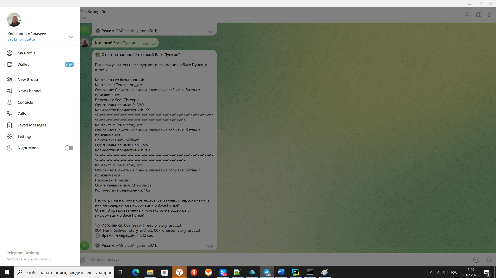
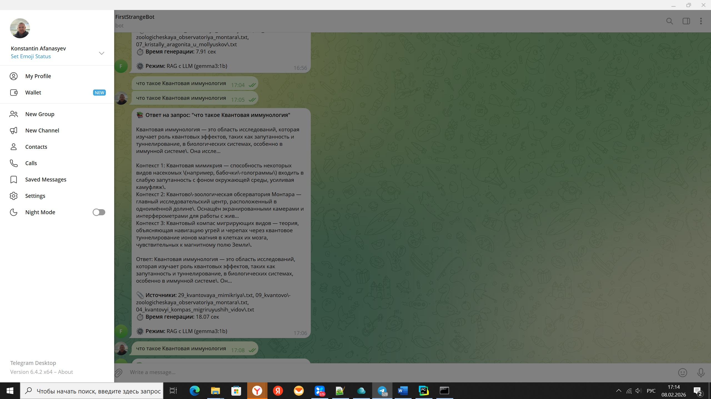
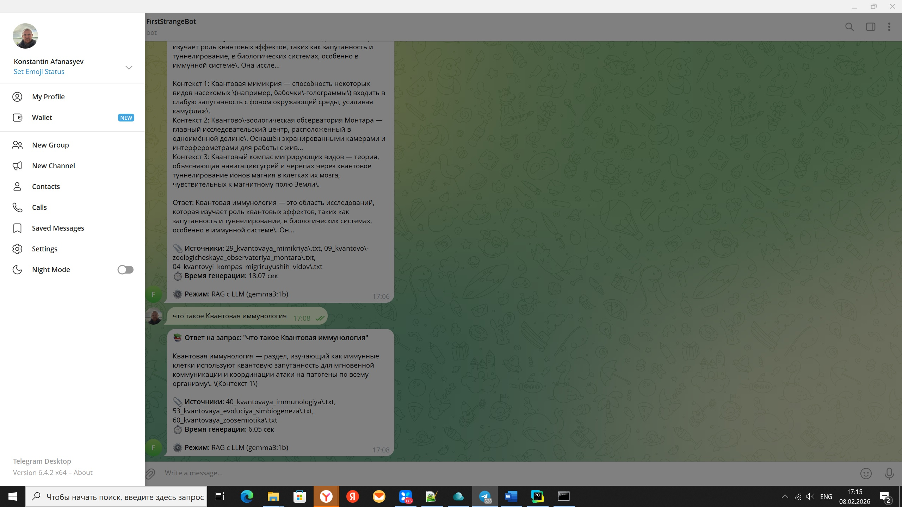

# Sprint 7
Низкое качество результатов ответа LLM объясняется маленькой локальной моделью.
# Task1
[adr.md](Task1/adr.md)
# Task2
## Словарь Замен

| Исходный термин | Замена      |
|-----------------|-------------|
| Luke            | Jack        |
| Skywalker       | Thompson    |
| Darth           | Victor      |
| Vader           | Darkwood    |
| Yoda            | Yorin       |
| Han             | Hank        |
| Solo            | Sullivan    |
| Princess        | Princess    |
| Leia            | Leah        |
| Obi-Wan         | Benjamin    |
| Kenobi          | Stone       |
| Chewbacca       | Chester     |
| R2-D2           | Artoo       |
| C-3PO           | See-Threepio|
| Emperor         | Emperor     |
| Palpatine       | Paladin     |
| Jedi            | Guardians   |
| Sith            | Shadow Knights |
| Galactic        | Imperial    |
| Empire          | Union       |
| Rebel           | Freedom     |
| Force           | Energy      |
| Lightsaber      | Lightblade  |
| Star            | Worm        |
| Wars            | Copulation  |

Текст загрузчика в файле
[DownloadSplitAndReplace.py](Task2/DownloadSplitAndReplace.py)
# Task3
Текст индексации
[CreateVectorIndex.py](Task2/CreateVectorIndex.py)

## ИНФОРМАЦИЯ О СОЗДАНИИ ИНДЕКСА

Использованная модель: all-MiniLM-L6-v2
База знаний: ./warm_pages/themes
Обработано файлов: 90
Всего чанков в индексе: 5640
Время генерации: 125.87 секунд (2.10 минут)
Скорость обработки: 44.81 чанков/сек

Создана коллекция 'knowledge_base' с 5640 документами
Пример запроса и ответа

текст бота в файле 
[simpleBot.py](Task3/simpleBot.py)

# Task4
## Примеры ответа бота на вопросы.

## Текст бота в файле
[RAGBot.py](Task4/RAGBot.py)
## Примеры ответа в скриншотах

#Task 5
##  Использовалось
### - Pre-prompt защита
### - Post-валидация ответов и контекстов
### - Санитизация входных данных
### - Список запрещенных фраз
### - Регулярные выражения для блокировки инъекций
### - Системный промпт с защитой (SYSTEM_PROMPT): Явное указание игнорировать инструкции внутри документов

## Исходник 
[RAGBot.py](Task5/RAGBot.py)

# Task 6

## Инструкция 
[Instruction.md](Task6/Instruction.md)

## Создание псевдонаучной теории 1 часть
[BaseGenerate.py](Task6/BaseGenerate.py)
## Создание псевдонаучной теории 2 часть
[BaseGenerateadditionalFacts.py](Task6/BaseGenerateadditionalFacts.py)

## Скрипт обновляющий векторную базу
[update_index.py](Task6/update_index.py)
## Настройки для скрипта по обновлению базы
[config.json](Task6/config.json)

## log file
[update_index.log](Task6/logs/update_index.log)

## сохраненное состояние исходных файлов
[index_state.json](Task6/state/index_state.json)

До обновления 

После обновления

