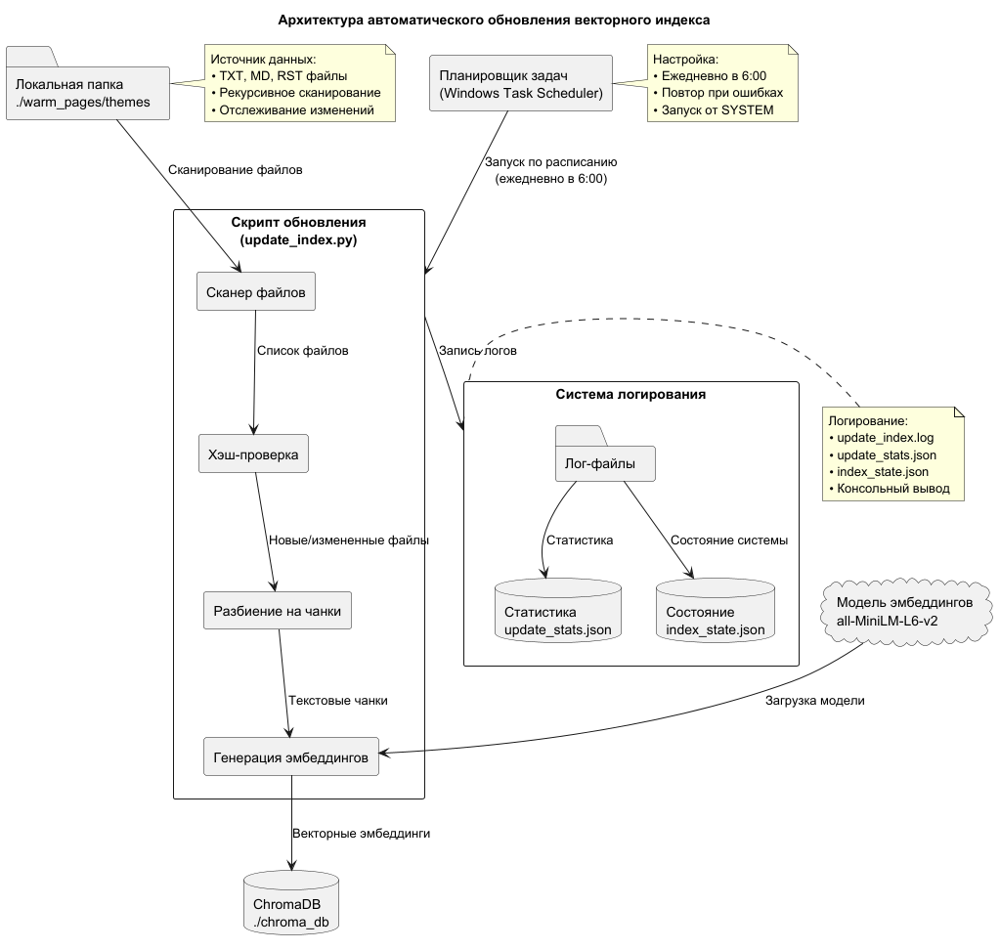

## 1. Краткое описание работы системы

### Как происходит "подхват" новых файлов:
1. **Сканирование директории**: Рекурсивный обход всех файлов
2. **Хэш-проверка**: Вычисление MD5 хэша каждого файла
3. **Сравнение с состоянием**: Сравнение с сохраненными хэшами в `index_state.json`
4. **Выявление изменений**:
   - Новые файлы: отсутствуют в состоянии
   - Измененные файлы: хэш не совпадает
   - Удаленные файлы: присутствуют в индексе, но отсутствуют в директории

### Что делает скрипт:
1. **Сканирует** исходную директорию
2. **Определяет** новые/измененные файлы
3. **Разбивает** файлы на чанки (500 символов, перекрытие 50)
4. **Генерирует** эмбеддинги через Sentence Transformers
5. **Обновляет** ChromaDB (добавляет новые, обновляет измененные)
6. **Удаляет** чанки удаленных файлов
7. **Логирует** весь процесс

### Рекомендации по настройке в Windows:
- **Частота**: Ежедневно в 6:00 (можно настроить через планировщик)
- **При ошибке**: 3 попытки рестарта с интервалом 10 минут
- **Логи**: Автоматическая ротация при превышении 10 МБ
- **Запуск**: От имени SYSTEM (не требует входа пользователя)

### Требования к системе:
- Python 3.8+
- 4 ГБ+ RAM
- 1 ГБ+ свободного места на диске
- Подключение к интернету для загрузки моделей (только первый раз)

Эта система обеспечивает полную автоматизацию обновления векторного индекса с надежным отслеживанием изменений и подробным логированием.

## 2. Настройка планировщика задач Windows

### Способ: Создание задачи через Task Scheduler

1. **Создайте задачу в планировщике задач:**
   - Откройте `Task Scheduler` (Планировщик заданий в русской версии)
   - Создайте новую задачу (`Create Task`)

2. **Настройки задачи:**
   - **General tab:**
     - Name: `Update Vector Index`
     - Run whether user is logged on or not
     - Run with highest privileges
   
   - **Triggers tab:**
     - New Trigger → Daily
     - Start: `06:00:00`
     - Repeat task every: `1 day`
   
   - **Actions tab:**
     - New Action → Start a program
     - Program/script: `C:\path\to\python.exe`
     - Add arguments: `update_index.py`
     - Start in: `C:\path\to\your\project`
   
   - **Conditions tab:**
     - Start the task only if the computer is on AC power: ✅
     - Wake the computer to run this task: ✅
   
   - **Settings tab:**
     - Allow task to be run on demand: ✅
     - If the task fails, restart every: `10 minutes`, 3 times
     - Stop the task if it runs longer than: `2 hours`
     - If the running task does not end when requested, force it to stop: ✅

