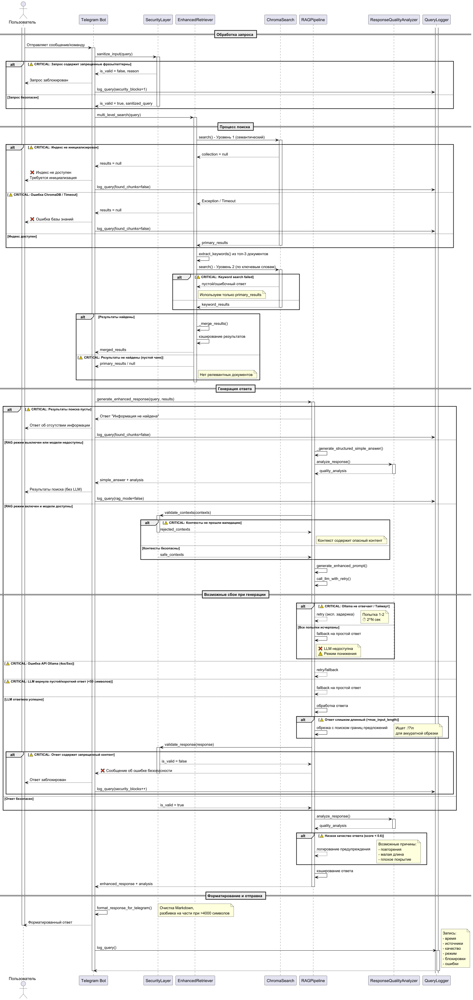

# Пролог

Для кого-то «Звёздные войны» — та же квантовая биозоология: тёмный лес для непосвящённых 

## Диаграмма работы BOT-а



## Результат тестового прогона

Тестовый прогон делался без использования telegramm путем простого вызова методов

[test_results.csv](test_results.csv)

## Логи работы (telegram)

[query_log.csv](query_log.csv)


## Анализ проблем

## **Основные проблемы по категориям:**

### **1. Низкое покрытие тем (coverage_percent < 40%):**
- **Квантовый компас у мигрирующих видов** (0%) - самая большая проблема
- **Критические взгляды на квантовую биозоологию** (0%)
- **Синдром разорванной запутанности** (0%)
- **Связь с экзобиологией** (0%)
- **Солнечные бури и миграция** (25%) - частично отвечает

### **2. Нерелевантные источники (наиболее проблемные вопросы):**

**а) Вопросы, где источники не соответствуют теме:**
- *"Как работает квантовый компас у мигрирующих видов?"*
  - **Полученные источники:** `07_kristally_aragonita_u_mollyuskov.txt`, `27_matematicheskaya_model_veira-kovalskogo.txt`, `39_effekt_obratnoi_kvantovoi_svyazi_u_primatov.txt`
  - **Проблема:** Нет документов о квантовом компасе, магнитных полях, ионах магния

- *"Какие критические взгляды на квантовую биозоологию?"*
  - **Источники:** `13_kodeks_etiki_kvantovoi_biozoologii.txt` (есть), `07_kristally_aragonita_u_mollyuskov.txt` (не релевантно), `34_biofotonnyi_obmen_u_svetlyashihsya_nasekomyh.txt` (не релевантно)

**б) Вопросы, где система дает ответ, хотя должна "не знать":**
- *"Какие конкретные генетические модификации предлагаются для усиления эффекта Вейра?"*
  - **Ситуация:** Система не находит информации (coverage 0%), но дает развернутый ответ на 3539 символов - это **галлюцинации LLM**

### **3. Проблемные ответы несмотря на высокий coverage:**
- *"Что такое квантовая биозоология?"* (33.3%) - базовый вопрос, но плохое покрытие
- Система часто выдает очень длинные ответы (3000-3500 символов), даже когда информации мало

##  **Рекомендации по расширению базы знаний:**

### **Необходимо добавить документы по темам:**

#### **1. Навигация и квантовые компасы:**
```
tema_15_kvantovyi_kompas_migriruyushih_vidov.txt
tema_16_magnitnoe_pole_i_navigaciya_ptic.txt  
tema_17_iony_magniya_v_navigacii_ugrei_i_cherepah.txt
```

#### **2. Критика и методология:**
```
tema_30_kritika_klassicheskoi_etologii.txt
tema_31_protivorechiya_kvantovoi_biozoologii.txt
tema_32_metodologicheskie_problemy_discipliny.txt
```

#### **3. Медицинские аспекты:**
```
tema_40_sindrom_razorvannoi_zaputannosti_lechenie.txt
tema_41_kvantovaya_veterinariya.txt
tema_42_terapiya_kvantovogo_stressa.txt
```

#### **4. Генетика:**
```
tema_50_geneticheskie_aspekty_effekta_veira.txt
tema_51_geneticheskie_modifikacii_dlya_usileniya_kvantovoi_svyazi.txt
```

#### **5. Прикладные аспекты:**
```
tema_60_ekonomicheskie_aspekty_kvantovoi_biozoologii.txt
tema_61_biokomputing_i_ego_primenenie.txt
```

#### **6. Связь с другими науками:**
```
tema_70_svyaz_s_ekzobiologiei.txt
tema_71_kvantovaya_biozoologia_i_astrobiologia.txt
```

##  **Технические проблемы в системе:**

### **1. Проблема семантического поиска:**
- ChromaDB не находит релевантные документы по ключевым запросам
- **Решение:** Пересмотреть эмбеддинги или добавить синонимы

### **2. Проблема с threshold качества:**
- Система выдает слишком длинные ответы при низком coverage
- **Решение:** Увеличить минимальный порог coverage для генерации ответа

### **3. Проблема с "отсутствующими" темами:**
- Для вопросов с `should_fail=True` система все равно дает развернутые ответы
- **Решение:** Добавить явную проверку и возвращать "Информация не найдена"

##  **Приоритеты для улучшения:**

### **Высокий приоритет:**
1. Добавить документы по квантовым компасам и навигации
2. Добавить документы по критике дисциплины
3. Исправить обработку вопросов, где информация должна отсутствовать

### **Средний приоритет:**
1. Улучшить точность семантического поиска
2. Добавить больше конкретных примеров и case studies
3. Расширить медицинские и генетические аспекты

### **Низкий приоритет:**
1. Добавить экономические и прикладные аспекты
2. Расширить связи с другими науками

## ⚡ **Немедленные действия:**

1. **Создать недостающие документы** (минимум 5-6 файлов по основным пробелам)
2. **Обновить векторный индекс**
3. **Настроить пороги качества** в `RAGTester._check_answer_quality()`:
   - Увеличить минимальное покрытие с 40% до 50-60%
   - Добавить проверку на длину ответа при низком coverage
4. **Улучшить обработку отсутствующих тем** - четче разделять "не знаю" и "знаю мало"

Система показывает хорошие результаты там, где информация есть в базе (эффект Вейра, этические проблемы), но **полностью проваливается по фундаментальным темам** (квантовый компас, критика дисциплины), что требует срочного расширения базы знаний.